# Booker

*Responsive, web application created using NextJS for booking properties, and managing your properties.*

## Application Desing

### *Single Property page*
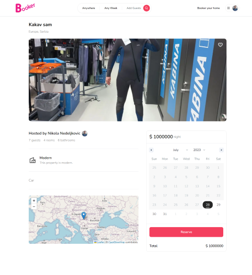

Page of a single property with all about that property.

### *Home page*
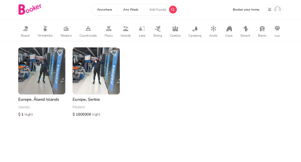

Home page of the application with all the properties and possibility to filter.

### *Login page*
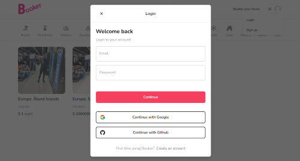

Page to login with credentials or google or github login.

### *Register page*
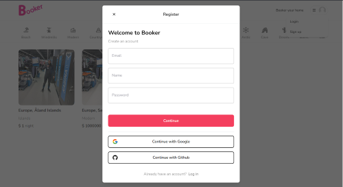

Page to register with credentials or google or github registration.

### *No Matches page*
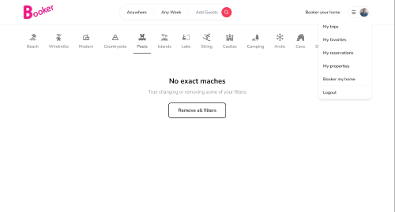

Page when filters find no property with given filters.

### *First Filter page*
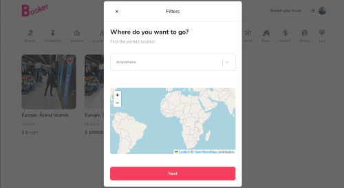

Modal for filtering properties - selecting the destination.

### *First Filter Select page*
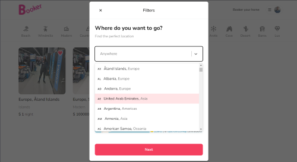

Modal for filtering properties - countries dropdown.

### *Second Filter page*
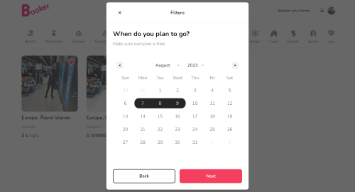

Modal for filtering properties - date selection.

### *Third Filter page*

Modal for filtering properties - number of guests, rooms and bathrooms input.

### *First Booker page*
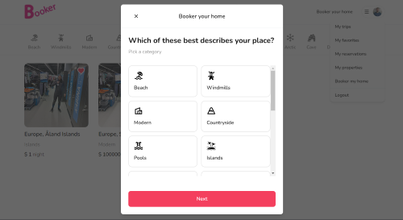

Modal for adding your own property - selecting a category.

### *Second Booker page*
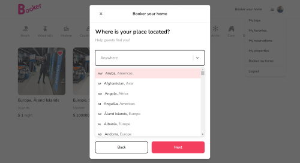

Modal for adding your own property - selecting the location of the property.

### *Third Booker page*
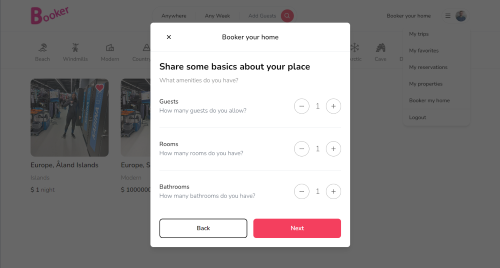

Modal for adding your own property - number of guests, rooms and bathrooms input.

### *Forth Booker page*
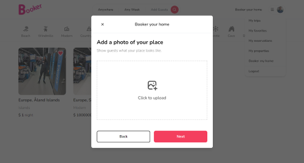

Modal for adding your own property - photo input.

### *Forth Booker Image page*
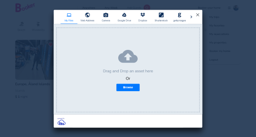

Modal for adding your own property - options for uploading the image.

### *Fifth Booker page*
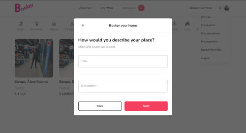

Modal for adding your own property - title and description properties.

### *Sixth Booker page*
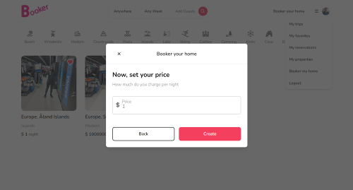

Modal for adding your own property - price input.

### *Loading page*
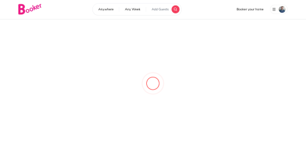

Page when loading is being done.

## Run the application using command *npm run dev*